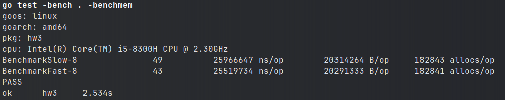
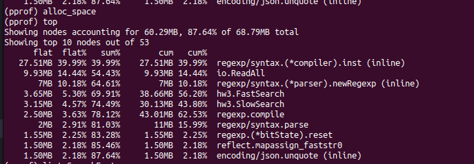

go tool pprof hw3.test mem.out
(pprof) alloc_space
(pprof) top

(pprof) list FastSearch
Основные проблемы
```
4.97MB     28:	fileContents, err := ioutil.ReadAll(file)

1.64MB     1.64MB     38:	lines := strings.Split(string(fileContents), "\n")

512.02kB   512.02kB     42:		user := make(map[string]interface{})

512.28kB        4MB     44:		err := json.Unmarshal([]byte(line), &user)

.    16.54MB     68:			if ok, err := regexp.MatchString("Android", browser); ok && err == nil {

.     9.50MB     90:			if ok, err := regexp.MatchString("MSIE", browser); ok && err == nil {

1MB        1MB    112:		foundUsers += fmt.Sprintf("[%d] %s <%s>\n", i, user["name"], email)

.   514.38kB    115:	fmt.Fprintln(out, "found users:\n"+foundUsers)
```
